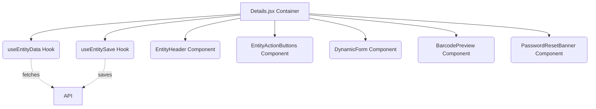

# Technical Design: Details.jsx Refactoring

## 1. Architecture Overview
The current `Details.jsx` is a tightly coupled monolith. The new architecture moves towards a container-presentational pattern paired with custom hooks for logic encapsulation.

### High-Level Component Map


## 2. File Structure

- `src/config/entityRules.js`: Exports `ENTITY_ALLOWED_ROLES` and `ENTITY_FIELD_RULES`.
- `src/hooks/useEntityData.js`: Hook managing data fetching and loading states.
- `src/hooks/useEntitySave.js`: Hook managing complex save logic, image queues, and stock adjustments.
- `src/pages/Details/Details.jsx`: The refactored main container.
- `src/pages/Details/components/EntityHeader.jsx`: Avatar, title, active badge, dates.
- `src/pages/Details/components/EntityActionButtons.jsx`: Action buttons logic (edit, cancel, account, etc.).
- `src/pages/Details/components/DynamicForm.jsx`: The form grid rendering fields.
- `src/pages/Details/components/BarcodePreview.jsx`: Isolated barcode rendering.
- `src/pages/Details/components/SkeletonDetails.jsx`: Loading skeleton UI.

## 3. Data Flow

### 3.1 Fetching
`Details.jsx` calls `const { data, loading, fetchData } = useEntityData(entity, id)`.
While `loading` is true, `SkeletonDetails` is rendered.

### 3.2 Saving
`Details.jsx` passes state (formData, pending images, pending stock) to `const { performSave, isSaving } = useEntitySave(entity, id, fetchData)`.
`performSave` executes the API calls and triggers `fetchData` on success to refresh the UI.

## 4. API Design / Interfaces

### `useEntityData` Signature
```javascript
function useEntityData(entity, id) {
  // returns { data, loading, error, fetchData }
}
```

### `useEntitySave` Signature
```javascript
function useEntitySave(entity, id, onSuccess) {
  // returns { performSave, isSaving }
  // performSave takes (changes, pendingStockAdjustment, pendingImageActions)
}
```

## 5. Security & Validation
Permissions check (`canAccessCurrentEntity`) remains in the top-level `Details.jsx` before any rendering to ensure unauthorized users are immediately redirected.
